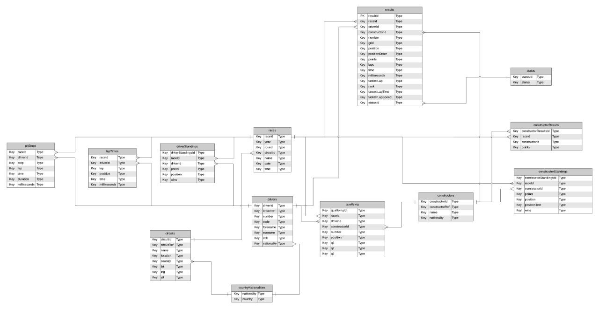

---
title: 'Informe de proyecto, Introducción a la Mineria de Datos'
title: 'Exploración de datos de carreras de formula 1'
Grupo: 'Grupo n°'
date: "Agosto 2020"
Integrantes: 'Ignacio Moore, José Rubio Fabián Sepúlveda, Ignacia Aguilera y Bastian'
output:
  html_document:
    theme: default
    toc: no
  pdf_document:
    toc: no

#Importación de librerias
```{r}
library(ggplot2)
library(dplyr)
library(gridExtra)
library(ggthemes)
library(RColorBrewer)
library(grid)
library(ggrepel)
library(viridis)
library(circlize)
library(GGally)
```

1. Introducción

La velocidad ha despertado desde hace mucho tiempo una gran cantidad de pasiones, desde la antigüedad el ser humano ha ha intentado desplazarse lo más rápido y eficientemente posible desde un sitio a otro. Inicialmente, los desplazamientos por tierra más rapidos se realizaron mediante la domesticación de algunos animales como el caballo o camello, sin embargo no fue hasta el siglo XIX donde se pudo dar un gran salto en los medios de transporte con la invención de la locomotora y la aparición de los primeros vehiculos. Este crecimiento se hizo excepcional con la invención del motor de combustión interna por parte del alemán Nikolaus Otto en 1886.

El motor de combustión interna permitió la fabricación de toda clase de vehiculos como motocicletas, automoviles, camionetas, camiones, aviones, etc. Dentro de toda esta clase de máquinas tambien se desarrollaron los automóviles de carreras con la finalidad de realizar competiciones entre los distintos fabricantes de vehiculos.

Dentro de las competiciones de automoviles, destaca el campeonato mundial de la fórmula 1 de la FIA mas conocida como la fórmula 1 o F1. Esta corresponde a la máxima competición automovilstica de todo el mundo, ademas de ser el deporte motor mas prestigioso de todo el orbe. Dada la importancia de este evento y la cantidad de dinero que mueve actualmente, los datos relacionados a los circuitos, caracteristicas de los automóviles, información de los pilotos, etc corresponde a información interesante de analizar. Dado esto, para el proyecto semestral del curso se utilizaran distintos tipos de información relacionada a esta competición con la finalidad de encontrar comportamientos no intuitivos en estas bases de datos. Con esots patrones se pueden desarrollar modelos que pueden llegar a estimar una gran cantidad de enventos futuros

Utilizando la data se espera obtener un sistema donde se encuentre una relación entre la nacionalidad del piloto con respecto al lugar donde gana, viendo el rendimiento en general del país en los circuitos y verificar su comportamiento, para esto se desarrollara el siguiente avance donde inicialmente se mostrará la forma que tienen los datos y analizando el tipo de información que contiene entonces se gráficaran distintos tipos de datos.

1.1 Objetivos Generales:
  1.Entender la correlación entre los datos de la formula 1
  2.Encontrar grupos que se relacionan
  3.Verificar el comportamiento

Para lograr los objetivos antes mencionados se utilizó un dataset que contenga información acerca de pilotos y su rendimiento.

1.2 Acerca del dataset
Este dataset contiene data desde 1950 al 2017 en todas sus temporadas, lo que otorga una gran cantidad de datos por analizar, esto es relevante dado que es una competencia tan importante donde cada vez es mas relavante mejorar las estrategias debido al gran avance tecnologico que ha tenido la industria automovilistica los ultimos años.Se puede encontrar este dataset en el siguiente enlace: https://www.kaggle.com/cjgdev/formula-1-race-data-19502017
      
2. Descricpción y exploración de los datos 
En primer lugar, para trabajar de manera cómoda con la base de datos, es necesario contar con un diagrama Entidad-Relación de esta. Así es posible realizar una inspección visual de las tablas de manera compacta y hacerse una idea del entorno sobre el cuál se trabaja.



A partir de este diagrama, es posible identificar que la tabla **results** (relativa a los resultados de la carrera) es la columna vertebral de esta base de datos. Alrededor de esta tabla, se pueden encontrar seis más ("status", "constructorResults", "constructorStandings", "constructors", "qualifying" y "races") con distintos atributos que pertenecen a una carrera en específico , estos datos serán analizados posteriormente.

HITO 1

### Importacion de Tablas

```{r}
circuits <- read.csv(file = "Data/circuits.csv", header = TRUE)
circuits$url <- NULL

constructorResults <- read.csv(file = "Data/constructorResults.csv", header = TRUE)

constructors <- read.csv(file = "Data/constructors.csv", header = TRUE)
constructors$X <- NULL
constructors$url <- NULL

constructorStandings <- read.csv(file = "Data/constructorStandings.csv", header = TRUE)
constructorStandings$X <- NULL

drivers <- read.csv(file = "Data/drivers.csv", header = TRUE)
drivers$url <- NULL

driverStandings <- read.csv(file = "Data/driverStandings.csv", header = TRUE)

lapTimes <- read.csv(file = "Data/lapTimes.csv", header = TRUE)

pitStops <- read.csv(file = "Data/pitStops.csv", header = TRUE)

qualifying <- read.csv(file = "Data/qualifying.csv", header = TRUE)

races <- read.csv(file = "Data/races.csv", header = TRUE)
races$url <- NULL

results <- read.csv(file = "Data/results.csv", header = TRUE)

seasons <- read.csv(file = "Data/seasons.csv", header = TRUE)
seasons$url <- NULL

status <- read.csv(file = "Data/status.csv", header = TRUE)

countryNationalities <- read.csv(file = "Data/countryNationalities.csv", header = TRUE)
```
Es posible además mostrar el tamaño de cada Dataframe:
  
```{r, collapse=TRUE}
dim1 <- paste(" circuits rows:", nrow(circuits),"; cols:", ncol(circuits),"\n")
dim2 <- paste(" constructorResults rows:", nrow(constructorResults),"; cols:", ncol(constructorResults),"\n")
dim3 <- paste(" constructor rows:", nrow(constructor),"; cols:", ncol(constructor),"\n")
dim4 <- paste(" constructorStandings rows:", nrow(constructorStandings),"; cols:", ncol(constructorStandings),"\n")
dim5 <- paste(" drivers rows:", nrow(drivers),"; cols:", ncol(drivers),"\n")
dim6 <- paste(" driverStandings rows:", nrow(driverStandings),"; cols:", ncol(driverStandings),"\n")
dim7 <- paste(" lapTimes rows:", nrow(lapTimes),"; cols:", ncol(lapTimes),"\n")
dim8 <- paste(" qualifying rows:", nrow(qualifying),"; cols:", ncol(qualifying),"\n")
dim9 <- paste(" races rows:", nrow(races),"; cols:", ncol(races),"\n")
dim10 <- paste(" results rows:", nrow(results),"; cols:", ncol(results),"\n")
dim11 <- paste(" seasons rows:", nrow(seasons),"; cols:", ncol(seasons),"\n")
dim12 <- paste(" status rows:", nrow(status),"; cols:", ncol(status),"\n")
dim13 <- paste(" countryNationalities rows:", nrow(countryNationalities),"; cols:", ncol(countryNationalities),"\n")
cat(paste(dim1,dim2,dim3,dim4,dim5,dim6,dim7,dim8,dim9,dim10,dim11,dim12,dim13))
```

Explorando *results*.
```{r}
str(results)
```
En base a lo observado se pueden analizar los atributos y eventualmente reducir la dimensionalidad de los datos.

- ```results``` es la llave primaria de la relación, permite identificar a una carrera.
- ```races```, ```drivers``` y ```status``` tienen relación con la carrera, dado que estas ya son identificables por ```results```, estas relaciones son prescindibles.
- ```nationality``` y ```country``` corresponden a la nacionalidad y pais de los pilotos y son atributos demográficos categóricos de interés.
- ```pitStops``` es una tributo que relaciona el piloto con la carrera.

Para comprender la demografía involucrada, a continuación se enlistan los atributos de nationality y countrye.
```{r}
summary(countryNationality$nationality)
summary(countryNationality$country)
```
Para continuar se realizara una exploración de datos partiendo con una busqueda de correlaciones entre los distintos atributos y como tienden en el tiempo.
Primero se observa una correlación entre position y nationality
```{r}
cor(results$position, as.numeric(countryNtionality$nationality))
```
En base a esto se realiza un grafico donde se puede ibservar la cantidad de conductores por pais.
```{r}

# CANTIDAD DE CORREDORES POR PAIS

numberOfDriversByNationality <- aggregate(driverId ~ nationality, drivers, length)
names(numberOfDriversByNationality)[names(numberOfDriversByNationality) == 'driverId'] <- 'numberOfDrivers'

library(ggplot2)

ggplot(numberOfDriversByNationality) +
  geom_bar(aes(x = reorder(nationality, numberOfDrivers), y = numberOfDrivers), stat = "identity") +
  coord_flip() +
  ggtitle("Cantidad de Conductores por Nacionalidad") +
  xlab("Nacionalidad") + ylab("Cantidad de Conductores")

```
Por otra parte se observa que ciertos paises tiene mayor cantidad de corredores si ahora lo comparamos con la canridad de carreras por pais.
```{r}

# CANTIDAD DE CARRERAS POR PAIS

racesByCircuit <- merge(circuits, races, by = "circuitId")
names(racesByCircuit)[names(racesByCircuit) == "name.x"] <- "circuitName"
names(racesByCircuit)[names(racesByCircuit) == "name.y"] <- "raceName"

numberOfRacesByCountry <- aggregate(raceId ~ country, racesByCircuit, length)
names(numberOfRacesByCountry)[names(numberOfRacesByCountry) == "raceId"] <- "numberOfRaces"

ggplot(numberOfRacesByCountry) +
  geom_bar(aes(x = reorder(country, numberOfRaces), y = numberOfRaces), stat = "identity") +
  coord_flip() +
  ggtitle("Cantidad de Carreras por Pais") +
  xlab("Pais") + ylab("Cantidad de Carreras")

```
Otra metrica relevante es cuantas veces participan los conductores en su pais esto ayuda a visualizar cuan importante es este piloto en competencias y sus años de experiencia en carreras.
```{r}

# CARRERAS EN QUE COINCIDEN CON CONDUCTORES

driversWithCountry <- merge(drivers, countryNationalities, by = "nationality")
names(driversWithCountry)[names(driversWithCountry) == "country"] <- "driverCountry"

homeDrivers <- merge(merge(driversWithCountry, results, by = "driverId"), racesByCircuit, by = "raceId")
names(homeDrivers)[names(homeDrivers) == "country"] <- "circuitCountry"

homeDrivers <- subset(homeDrivers, select = c("driverCountry", "circuitCountry", "driverRef", "raceName", "circuitName", "raceId", "driverId"))

homeDrivers[,1] <- factor(homeDrivers[,1], levels = levels(homeDrivers[,2]))

homeDrivers <- subset(homeDrivers, homeDrivers$circuitCountry == homeDrivers$driverCountry)

homeDriversByCountry <- aggregate(raceId + driverId ~ circuitCountry, homeDrivers, length)
names(homeDriversByCountry)[names(homeDriversByCountry) == "raceId + driverId"] <- "numberOfParticipations"

ggplot(homeDriversByCountry) +
  geom_bar(aes(x = reorder(circuitCountry, numberOfParticipations), y = numberOfParticipations), stat = "identity") +
  coord_flip() +
  ggtitle("Cantidad de veces que Conductores han Participado en su Pais") +
  xlab("Pais") + ylab("Cantidad de veces que han participado")

```

Enfocandonos en la nacionalidad de los distintos pilotos, se crea un nuevo dataframa con el cual podemos obtener los principales paises que tienen relevancia en la fomula 1

```{r}
countryNationality <- read.csv(file="Data/countryNationalities.csv",header=TRUE)
```

Creando dataframes para incluir el país de la nacionalidad mencionada.

```{r}
d_nationality <-drivers[,c('driverId','driverRef','nationality')]
d_nationality <- merge(d_nationality, countryNationality, by='nationality' )
c_nationality <- constructors[, c("constructorId", "name", "nationality")]
c_nationality <- merge(c_nationality, countryNationality, by="nationality")
names(c_nationality)[names(c_nationality) == "nationality"] <- "c_nationality"
names(c_nationality)[names(c_nationality) == "country"] <- "c_country"
```

### Ganadores por país.
Filtrando los resultados para obtener las nacionalidades de aquellos conductores que ganaron los circuitos.
```{r}
winners <- results[results$positionOrder == 1,]
winners_data <- merge(winners,d_nationality, by='driverId')
winners_by_country <- aggregate(position ~ country, winners_data, length)
names(winners_by_country)[names(winners_by_country) == "position"] <- "races_won"
ggplot(winners_by_country) +
  geom_bar(aes(x=reorder(country, races_won),y=races_won),stat="identity") +
  coord_flip() +
  ggtitle("Paises Ganadores de la formula 1") +
  xlab("Cantidad") +
  ylab("País")
```

### Fabricantes ganadores por país.
Similar al anterior, solo que en este caso se realiza la consulta para obtener las nacionalidades de los países que fabrican los vehiculos para la competición.

```{r}
winners_constructors <- merge(winners,c_nationality, by='constructorId')
winnersc_by_country <- aggregate(position ~ c_country, winners_constructors, length)
names(winnersc_by_country)[names(winnersc_by_country) == "position"] <- "races_won"
ggplot(winnersc_by_country) +
  geom_bar(aes(x=reorder(c_country, races_won),y=races_won),stat="identity") +
  coord_flip() +
  ggtitle("Paises Fabricantes Ganadores de la formula 1") +
  xlab("Cantidad") +
  ylab("País")
```
Los comportamientos obtenidos entregan una fuerte dominación por parte de los pilotos y vehiculos británicos Especialmente los fabricantes del Reino unido, cuyos vehiculos han ganado mas de la mitad de las competiciones (492 de 979 carreras, un 50,25%).

HITO 2
En esta estapa del proyecto queremos centrarnos en encontrar ciertos patrones o grupos con caracteristicas similares para entender mejor si puede observar alguna estrategica o obtener alguna predección en base a los datos de las carreras que se realizan.
Para esto en primera instancia buscamos relaciones entre las victorias de las marcas fabricantes, nacionalidades de los competidores y lugar de la carrera, para conocer que país y fabricante tiene dominio en la competencia de cada área. Por ejemplo en el siguiente gráfico se ve cuantos países han ganado en un circuito realizado en Italia.

```{r}
Italian_races <- racesByCircuit[racesByCircuit$country == "Italy",]
Italian_races_winners <- merge(Italian_races, winners, by="raceId")
Italian_races_winners <- Italian_races_winners[,c("driverId","constructorId","position")]
Italian_races_winners <- merge(Italian_races_winners, d_nationality, by="driverId")
Italian_races_winners <- merge(Italian_races_winners, c_nationality, by="constructorId")
Italian_d_Nationality_winners <- aggregate(position ~ country, Italian_races_winners, length)
Italian_c_Nationality_winners <- aggregate(position ~ c_country, Italian_races_winners, length)
names(Italian_d_Nationality_winners)[names(Italian_d_Nationality_winners) == "position"] <- "races_won"
names(Italian_c_Nationality_winners)[names(Italian_c_Nationality_winners) == "position"] <- "races_won"
ggplot(Italian_d_Nationality_winners)+
  geom_bar(aes(x=reorder(country,races_won),y=races_won),stat = "identity")+
  ggtitle("Paises ganadores en Italia")+
  coord_flip()+
  xlab("País")+
  ylab("Cantidad de victorias")

```
Gráfico con los países fabricantes ganadores en Italia
```{r}
ggplot(Italian_c_Nationality_winners)+
  geom_bar(aes(x=reorder(c_country,races_won),y=races_won),stat = "identity")+
  ggtitle("Paises fabricantes ganadores en Italia")+
  coord_flip()+
  xlab("País")+
  ylab("Cantidad de victorias")
```
Se espera tener gráficos de esta forma para averiguar si existe alguna relación entre la nacionalidad del piloto y el lugar donde se realiza la carrera. Para este caso se tiene que para los circuitos desarrollados en Italia, se ve claramente que los competidores y vehiculos britanicos poseen una gran cantidad de victorias. Tambien se desea ver si ha existido dominio de otro país en alguna época. Para ello se realizaran diversas consultas en los dataframes con la finalidad de encontrar comportamientos que apoyen o refuten esta hipótesis.


Por otra parte en esta estapa del proyecto desarrollar un modelo que permita estudiar las estrategias más eficaces para obtener un mejor resultado. Para esto en primer lugar se desea obtener un dataset que contenga información sobre los tiempos de las vueltas y parada en los pitstop para todas las carreras disponibles (aquellas que tengan información en pitStop) y los conductores que participaron dichas competiciones. 

```{r}
# Desarrollo de funciones para calcular el tiempo promedio de vueltas y pitstop.

# Funcion para calcular el tiempo promedio para un piloto en alguna carrera.
driver_race_features <- function(driver_id, race_id, dataset){
  a <- dataset[dataset$driverId == driver_id & dataset$raceId == race_id, ]
  a
}

# Similar al anterior, pero calcula el tiempo promedio del pitstop.
driver_race_mean <- function(driver_id, race_id, dataset){
  df_lap <- driver_race_features(driver_id, race_id, dataset)
  mean(df_lap$milliseconds)
}

```

Dado los datos es interesante saber cual es la probabilidad de choque en un carrera, dado que revisando los datos se pudo identificar que exiten muchos outliers que se pueden deben a lo variable que puede ser una carrera al estar expuesta a muchas situaciones que no tiene correlación.
Probabilidad de chocar o tener un accidente dependiendo de la posicion en que se inicia la carrera.

```{r}

require(dplyr)
library(ggplot2)

total_races <- results %>% count(grid)
names(total_races)[names(total_races) == "n"] <- "total"

dnfs <- results[results$statusId == 3 |
                results$statusId == 4 |
                results$statusId == 130,]
dnfs <- dnfs %>% count(grid)
names(dnfs)[names(dnfs) == "n"] <- "dnfs"


calc <- merge(total_races, dnfs, by = "grid")
calc$dnf_probability <- (calc$dnfs/calc$total)*100

ggplot(calc) +
  geom_bar(aes(x=grid, y=dnf_probability), stat = "identity") +
  xlab("Posicion en que se inicia la carrera") +
  ylab("Porcentage de no terminar la carrera") +
  ggtitle("Probabilidad de chocar o tener un accidente")

```
Si nos enfocamos en los pits que es una variable en la carrera muy importante ya que debido a esto se puede definir un ganador, por lo que los equipos se preocupan de como eviatra el tiempo lo mayormente posible

```{r}
pitStops <- within(pitStops, { count <- ave(lap, driverId, raceId, FUN=function(x) length(unique(x)))})

datas <- pitStops[pitStops$stop == 1, ]
data_f <- merge(d, datas[c("raceId","driverId","count")], by = c("raceId","driverId"))
data_f <- merge(data_f, results[c("raceId","driverId","points")], by = c("raceId","driverId"))
data_final <- merge(data_f, races, by = "raceId")

```

```{r}
ggplot(data_final, aes(x=as.character(count), y=lap_mean, fill=as.character(count))) +
    geom_violin() + geom_boxplot(width=0.2, color="grey", alpha=0.3) +
    ggtitle("Mean laptime distribution across number of pitstops") +
    scale_fill_viridis(discrete=TRUE) +
    scale_color_viridis(discrete=TRUE) +
    theme(
      legend.position="none"
    ) +
    coord_flip() +
    xlab("Number of pit stops") + 
    ylab("Mean laptime [miliseconds]")
```

```{r}
d_alt <- merge(pitStops, races, by = c("raceId"))
pitstops_year <- aggregate(milliseconds ~ year, d_alt, FUN=median)
ggplot(pitstops_year, aes(x=year, y=milliseconds, fill=year)) +
  geom_point() + geom_line() +
  ggtitle("Yearly mean pitstop times") +
  theme(
    legend.position="none"
  ) +
  xlab("Year") + 
  ylab("Mean pitstop time [miliseconds]")
```

Otro atributo interesante es lapTime.

```{r}
d_alt <- merge(lapTimes, races, by = c("raceId"))
laptime_year <- aggregate(milliseconds ~ year, d_alt, FUN=median)
ggplot(laptime_year, aes(x=year, y=milliseconds, fill=year)) +
  geom_point() + geom_line()+
  ggtitle("Yearly mean lap times") +
  theme(
    legend.position="none"
  ) +
  xlab("Year") + 
  ylab("Mean laptime [miliseconds]")
```

Buscando una correlación entre otros atributos para encontrar un clustering adecuado
```{r}
data_corr <- data_f[c("lap_mean","pitStop_mean","count","points")]
ggpairs(data_corr, title="Correlogram of relevant data") 
```

Se realiza una regresión 
```{python}
import pandas as pd
import matplotlib.pyplot as plt
import numpy as np 
import time

import xgboost
import seaborn as sn
from sklearn.ensemble import RandomForestClassifier, RandomForestRegressor
from sklearn.tree import DecisionTreeClassifier, DecisionTreeRegressor
from sklearn.preprocessing import RobustScaler, MinMaxScaler, StandardScaler
from sklearn.model_selection import train_test_split
from sklearn.metrics import mean_squared_error, f1_score, confusion_matrix
from sklearn.svm import NuSVR, LinearSVR, NuSVC, LinearSVC
```

```{python}
# Funcion que entrena un modelo de regresion, lo testea, plotea y entrega metricas
def training_reg(model, X_train_norm, y_train, X_test_norm, y_test, title):
    model.fit(X_train_norm, y_train)
    y_pred = model.predict(X_test_norm)
    
    print('\n'+title)
    errors = mean_squared_error(y_pred, y_test)
    print('MSE:', errors)
    corr = np.corrcoef(y_pred, y_test)
    print('Correlation:',corr[0,1])
    
    plt.figure()
    plt.plot(y_pred, y_test,'.')
    plt.title(title, size=24)
    plt.xlabel('Predicted position', size=14)
    plt.ylabel('Real position', size=14)
    plt.show()
    
    return model
    
# Funcion que entrena un modelo de clasificacion, lo testea, plotea y entrega metricas
def training_clf(model, X_train_norm, y_train, X_test_norm, y_test, title):
    model.fit(X_train_norm, y_train)
    y_pred = model.predict(X_test_norm)
    
    print('\n'+title)
    f1 = f1_score(y_pred, y_test, average='macro')
    print('F1 score:', f1)

    cm=np.flip(confusion_matrix(y_test, y_pred), axis=0)
    df_cm = pd.DataFrame(cm, index = [i for i in np.arange(23,0,-1)],
                          columns = [i for i in np.arange(1,24)])

    plt.figure(figsize=(16,12))
    sn.heatmap(df_cm, annot=True, robust=True)
    plt.title(title, size=24)
    plt.xlabel('Predicted position', size=14)
    plt.ylabel('Real position', size=14)
    plt.show()
    
    return model
```

```{r}
data_final$pos[is.na(data_final$pos)] <- 23
data_final <- data_final[!is.na(data_final$lap_mean), ]
```

```{python}
data_raw = r.data_final
data_raw = data_raw.loc[:,['lap_mean','pitStop_mean','count','pos']]
data = data_raw[data_raw.notna().all(axis=1)]

X = data.loc[:, data.columns != 'pos']
y = data.loc[:, 'pos']
X_train, X_test, y_train, y_test = train_test_split(X, y, test_size=0.3)

scaler = StandardScaler()
X_train_norm = scaler.fit_transform(X_train)
X_test_norm = scaler.transform(X_test)
```

```{python}
dt_reg = DecisionTreeRegressor(max_leaf_nodes=64)
dt_reg_trained = training_reg(dt_reg, X_train_norm, y_train, X_test_norm, y_test,'Decision Tree')

rf_reg = RandomForestRegressor(max_leaf_nodes=1024)
rf_reg_trained = training_reg(rf_reg, X_train_norm, y_train, X_test_norm, y_test, 'Random Forest')

xgb_reg = xgboost.XGBRegressor()
xgb_reg_trained = training_reg(xgb_reg, X_train_norm, y_train, X_test_norm, y_test, 'XGBoost')

svm_reg = NuSVR()
svm_reg_trained = training_reg(svm_reg, X_train_norm, y_train, X_test_norm, y_test, 'SVM')
```


```{python}
dt_clf = DecisionTreeClassifier(max_leaf_nodes=2*1024)
dt_clf_trained = training_clf(dt_clf, X_train_norm, y_train, X_test_norm, y_test,'Decision Tree')

rf_clf = RandomForestClassifier(max_leaf_nodes=2*1024)
rf_clf_trained = training_clf(rf_clf, X_train_norm, y_train, X_test_norm, y_test, 'Random Forest')

xgb_clf = xgboost.XGBClassifier()
xgb_clf_trained = training_clf(xgb_clf, X_train_norm, y_train, X_test_norm, y_test, 'XGBoost')

svm_clf = LinearSVC()
svm_clf_trained = training_clf(svm_clf, X_train_norm, y_train, X_test_norm, y_test, 'SVM')
```

Por otra parte se realiza una cluster de acuerdo a la siguiente metodologia

```{r}
# Bucle para el desarrollo deL DATAFRAME
drivers_array <- sort(unique(pitStops$driverId)) # Pilotos que tienen registrados sus datos en Pitstops
races_array <- sort(unique((pitStops$raceId))) # Carreras regisradas en PitStops.
df_stats <- data.frame(Race_id = c(), Driver_id = c(), lap_mean = c(), pitStop_mean = c(), constructor_id = c(), pos = c()) # Dataframe vacío.

# Creando una iteración para añadir información al dataframe vacío

for (k in races_array){
  for (i in drivers_array){
    race = k # Carrera
    driver = i # Piloto
    Lap_mean = driver_race_mean(driver, race, lapTimes) # Tiempo de Vuelta Promedio (milisegundos)
    pitstop_mean = driver_race_mean(driver, race, pitStops) # Tiempo pitstop promedio (milisegundos)
    if (is.nan(Lap_mean) & is.nan(pitstop_mean)){ # Condición para eliminar las carreras en las que el piloto no participó
      next
    }
    result_sample = results[results$raceId == race & results$driverId == driver, ] # Extrayendo información del dataset result.
    Constructor = result_sample$constructorId # Escudería de esa instancia
    position_f = result_sample$position # Posición obtenida, si sale NA entonces el piloto no concluyó la carrera
    df_sample = data.frame(Race_id = race, Driver_id = driver, lap_mean = Lap_mean, pitStop_mean = pitstop_mean, constructor_id = Constructor, pos = position_f) # Escribiendo la muestra
    df_stats = rbind(df_stats, df_sample) # Añadiendolo al dataframe.
  }
}
```

```{r}
head(df_stats)
write.csv(df_stats, "df_stats.csv") # Guardando el dataframe creado en un archivo .csv
```

```{r}
races_id <- df_stats$Race_id
circuitId <- c()
for (k in races_id){
  circuit_data <- races[races$raceId == k,]
  circuit_id <- circuit_data$circuitId
  circuitId <- c(circuitId, circuit_id)
}
```

Inclusión del id del circuito al dataframe creado.

```{r}
df_stats_2 <- cbind(circuitId, df_stats)
head(df_stats_2)
```


```{r}
df_stats$circuit_id <- array_circuitId
head(df_stats)
```

```{r}
head(pitStops)
```


```{r}
head(races)
```


```{r}
head(results)
```

```{r}
# Importando las librerías para la aplicación de dbscan.
library("dbscan")  
library("ggplot2")
```

```{r}
init_pos <- results$grid
final_status <- results$statusId
relation_df <- data.frame(grid=init_pos,status=final_status)
relation_df2 <- data.frame(status=final_status, grid=init_pos)
head(relation_df)
```

```{r}
grid_accident_df <- relation_df[relation_df$grid > 20 & relation_df$grid < 30,]
rownames(grid_accident_df) <- NULL
head(grid_accident_df)
```

```{r}
dbscan::kNNdistplot(grid_accident_df, k=3)   # k vecinos
abline(h=1, lty=2, col="red")  # ajuste h

```

```{r}
# Configurando dbscan para analizar si existen clusters mediante este método.
db_grid_st <- dbscan(grid_accident_df[, c(1,2)], eps=2.5 , minPts = 5)

# Ploteo del gráfico del clustering.

library(ggplot2)
grid_accident_df$cluster <- factor(db_grid_st$cluster)
ggplot(grid_accident_df, aes(x=grid, y=status, colour=cluster)) + ggtitle("Dbscan para grid entre 10 y 20") + geom_point() #+ png("grid_status.png")
```

Densidad de status para cada posicion grid obtenida, estas se realizan mediante un diagrama de cajas.

```{r}
plot(grid_accident_df$grid, grid_accident_df$status, main="Densidad de stats", xlab="grid", ylab="status")
```

```{r}
plot(relation_df$grid, relation_df$status, main="Densidad de stats", xlab="grid", ylab="status")
```

```{r}
#png("Status_density.png")
boxplot(status~grid, data=relation_df, main="Densidades de status",xlab = "posición inicial",ylab = "Status", col="orange",border="brown" ,outline=TRUE)
```

```{r}
dbscan::kNNdistplot(relation_df, k=3)   # k vecinos
abline(h=2.8, lty=2, col="red")  # ajuste h
```


```{r}
# Configurando dbscan para analizar si existen clusters mediante este método.
db_grid_st <- dbscan(relation_df[, c(1,2)], eps=2.5 , minPts = 5)

# Ploteo del gráfico del clustering.

library(ggplot2)
relation_df$cluster <- factor(db_grid_st$cluster)
ggplot(relation_df, aes(x=grid, y=status, colour=cluster)) + geom_point()
```


Conclusiones 

Con respecto a nuestra hipotesis para este proyecto, se concluye 


Consideraciones para un estdio futuro

Dado los análisis realizados en este proyecto, los próximos pasos a realizar son aumentar los datos a realizar inclutendo un dataset que contenga información sobre los distintos sensores o tecnologia que tiene el auto en las distintas carreras, ya que de esta forma se puede encontrar más correlaciones y viendo las investigaciones que se tiene actualmente es la busqueda de estrategias mediante el conocimiento del estado del auto para realizar la decisión mas acertada para ganar la carrera.
# Contribuciones de los miembros del equipo

En conjunto se escogio la hipotesis a enfrentar en este proyecto y se describe lla participación de cada unos de los integrantes.

Ignacio Moore estuvo a cargo de la importacion y limpieza de datos, tambien realizo el analisis de los primeros tres graficos. Luego en las siguientes etapas realizo los de probabilidad de choque y el estudio de Grid postion and finishing position relation.

Jose Rubio estuvo a cargo del desarrollo de funciones para calcular el tiempo promedio de vueltas y pitstop, para la parte de clustering  realizo la configuranción de  dbscan para analizar si existen clusters mediante este método y luego obtuvo el grafico 
de clustering

Ignacia Aguilera estuvo a cargo de la exploración de datos donde se obtuvieron las dimensione y los graficos de las distintas correlaciones de los atributos. Y en el resto del trabajo estuvo apoyando la programación

Bastian estuvo a cargo de los graficos que relacionan pitStops y luego realizo la regresión de los datos.


